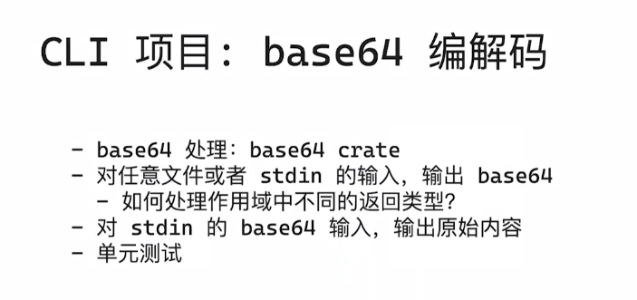
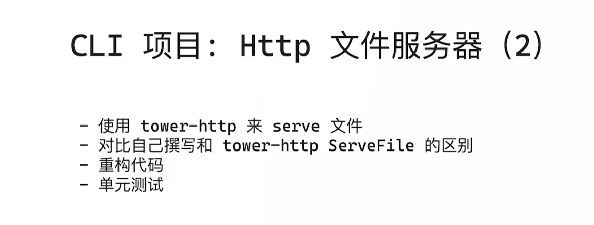

# RCLI

cli is a rust CLI tool.

## 项目


## 学什么


## 词汇表


## Rust 基础学习

可以在这个网站, 学习简单的 Rust 语法: https://learnxinyminutes.com/rust/




```bash
$ cargo run base64 decode -i Cargo.toml > fixtures/b64.txt
// 运行上述命令将print输出到某个文件中
```





